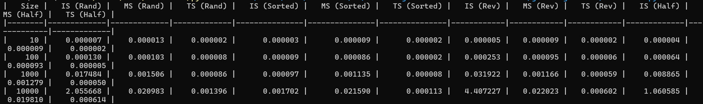

1. Сортування вставками (Insertion Sort, IS):
Малі набори даних (розмір 10):

Час виконання був мінімальним на всіх типах даних, від 0.000007 секунд для випадкових даних до 0.000003 секунд для відсортованих. Це очікувано, оскільки алгоритм ефективний на невеликих масивах і майже відсортованих даних.
Середні набори даних (розмір 100):

Випадкові дані — 0.000130 секунд, відсортовані — 0.000009 секунд, зворотно відсортовані — 0.000253 секунд, наполовину відсортовані — 0.000064 секунд. Час виконання збільшується для зворотно відсортованих даних, що підтверджує квадратичну складність.
Великі набори даних (розмір 10000):

Час для зворотно відсортованих даних значно збільшився до 4.407227 секунд, вказуючи на неефективність алгоритму для великих і невідсортованих масивів.
2. Сортування злиттям (Merge Sort, MS):
Всі набори даних:
Час виконання залишався стабільним і незначно змінювався з типом даних. Наприклад, для набору даних розміром 10000 час варіювався від 0.020983 секунд для випадкових до 0.022023 секунд для зворотно відсортованих даних.
Це підтверджує його стабільну складність O(nlogn) і незалежність від початкового упорядкування даних.
3. Timsort (TS):
Всі набори даних:
Timsort показав найшвидші часи виконання на всіх типах даних і розмірах масивів. Наприклад, для набору розміром 10000 час виконання був 0.000614 секунд для наполовину відсортованих даних, що значно швидше, ніж у інших алгоритмів.
Алгоритм зберігає високу ефективність завдяки використанню сортування вставками для малих сегментів даних і злиття для великих частин, що дозволяє оптимально обробляти як відсортовані, так і зворотно відсортовані дані.
Загальні висновки
Ефективність Timsort: Дані підтверджують, що Timsort є найефективнішим алгоритмом сортування для широкого спектру випадків. Це пояснює його використання як стандартного алгоритму сортування в Python.

Сортування вставками: Ефективно для малих і майже відсортованих масивів, але значно поступається за продуктивністю на великих або невідсортованих наборах даних.

Сортування злиттям: Залишається стабільним і надійним вибором для сортування великих обсягів даних, незалежно від їх попереднього упорядкування.

Ці висновки підкреслюють важливість вибору правильного алгоритму сортування залежно від типу даних і розміру масиву для забезпечення максимальної ефективності роботи програм.